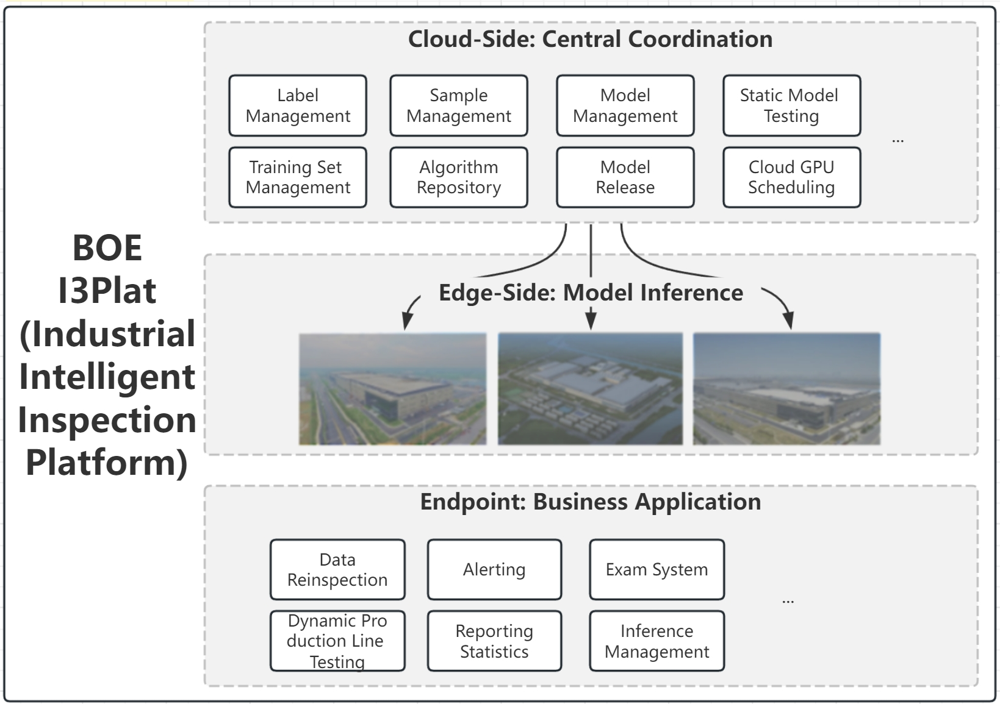
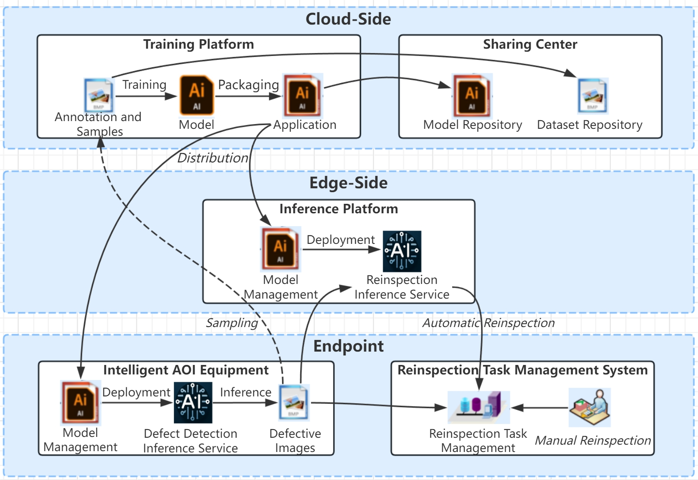
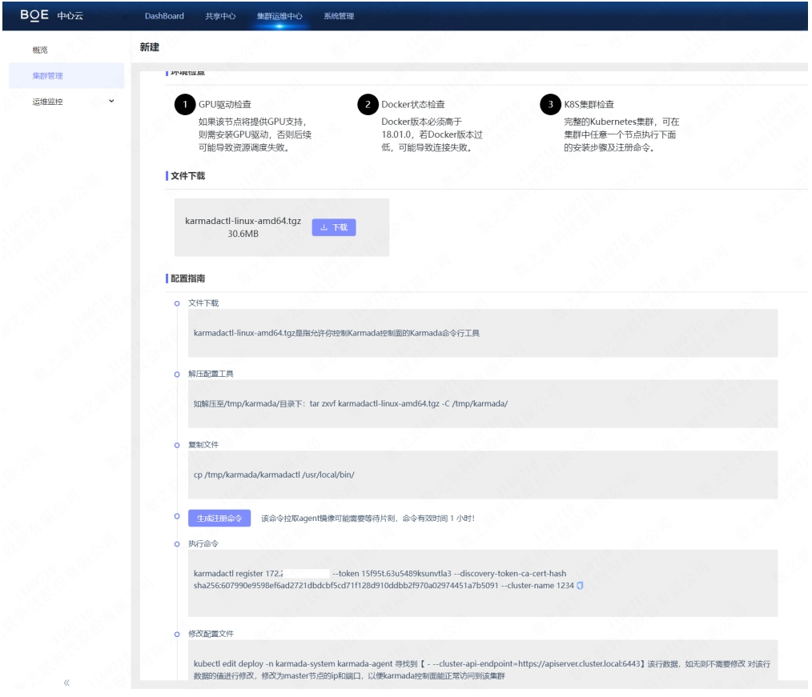
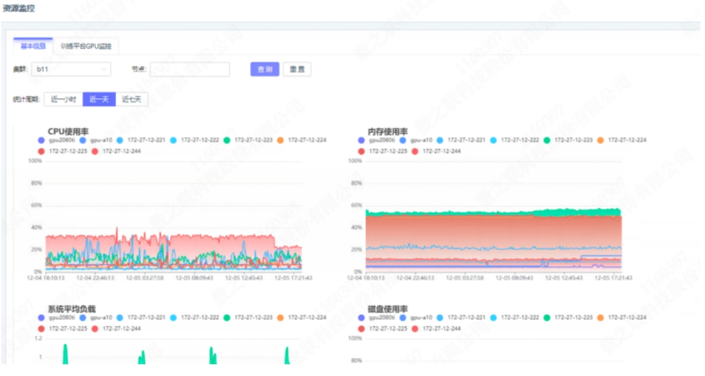
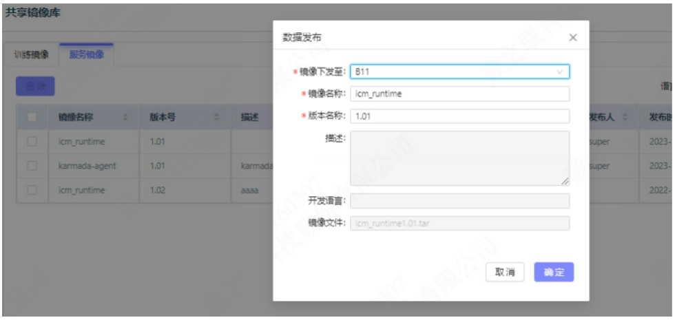
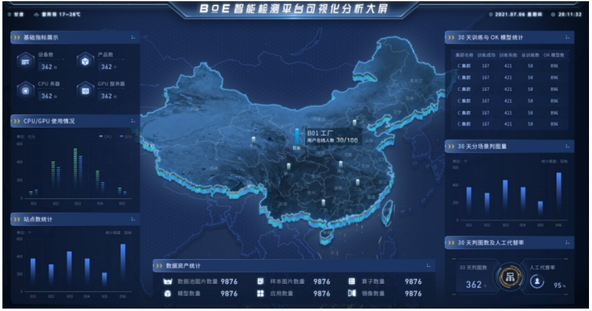

## Industry Background

In the LCD panel production field, products often develop defects due to a variety of factors. To address this, Automatic Optical Inspection (AOI) equipment, which utilizes optical principles to detect common flaws, was introduced after critical stages in the manufacturing process. However, existing AOI equipment could only detect whether a defect was present, requiring manual intervention to classify and identify false defects, which was both time-consuming and labor-intensive. [BOE Group](https://www.boe.com/) initially implemented an Automatic Defect Classification (ADC) system in one factory to enhance the accuracy of defect judgment and reduce the strain on workers. This system employs deep learning technology to automatically categorize images of defects identified by AOI, filtering out erroneous assessments, thereby increasing production efficiency.

BOE initially introduced ADC in one factory, and then expanded its use to other factories, saving manpower and increasing the efficiency of judgments. Despite this advancement, the complexity of the processes and differences between suppliers led to fragmented and decentralized construction at the factory sites, complicating data sharing and operational maintenance. To address these issues, BOE initiated the construction of the Industrial Intelligent Detection Platform (I3Plat), which employs artificial intelligence to standardize intelligent detection and enhance both production efficiency and the yield rate.



I3Plat centralizes ADC as its core, extending to model training and detection reinspection, achieving an integrated "cloud" (management + training) + "edge" (inference) + "endpoint" (business) solution, aiming to enhance production quality and the value of data through a standardized platform. The construction scope at the factory sites includes a resource sharing center, on-site training, and edge-side inference sub-platforms, all of which will be implemented across multiple factories.



The project aims to launch ADC at the factory sites, facilitate resource sharing, and achieve cloud-edge standardization to reduce the operational burden and uphold high standards. I3Plat is designed to streamline and standardize BOE Group's ADC systems across factories, providing a blueprint and reference for future ADC deployments. This aims to reduce costs and timeframes, and boost both production efficiency and the quality inspection process, ultimately improving product yields. It includes roles like system administrators, resource allocators and entails workflows for ADC inference, model training, data sharing, as well as cloud collaboration features, ensuring an automated defect classification process, and enhancing the usage of models and defective image data.

## Product and Technical Implementation

### Cluster Management

Factories can register their respective K8s clusters with the central cloud system, which then manages these clusters from a single point.



We have chosen the PULL mode.

To reduce the operational cost for operators, we offer a step-by-step registration process within the central cloud.

1. Guide the installation of karmada-agent.
2. Generate a token using karmadactl token create in the control plane.
3. Proceed with the registration using karmadactl register.
4. Edit the deploy/karmada-agent created by karmadactl register in the member cluster to ensure its access to the kube-apiserver of that member cluster.

### Using Aggregate Layer API

Through the cluster unification access provided by the karmada-aggregator component, we are able to implement functions in the central cloud that amalgamate data from member clusters, such as visualized dashboards.

Typically we expose functions implemented in Java using Service, and invoke kubectl get --raw with Java Fabric8 or similar clients:

```
/apis/cluster.karmada.io/v1alpha1/clusters/%s/proxy/api/v1/namespaces/%s/services/%s/proxy/%s
```

#### Cluster Monitoring

For online clusters, the central cloud system can display monitoring data for key metrics such as memory, CPU, disk, network ingress and egress rates, GPU, and logs, with the ability to switch between cluster views.



The central cloud can see the same monitoring as the training cloud, with the cluster's Java program encapsulating PromQL through Karmada's aggregate layer API to provide to the front-end page. Below is an example Java query for node CPU utilization:

```
/apis/cluster.karmada.io/v1alpha1/clusters/%s/proxy/api/v1/namespaces/%s/services/%s/proxy/api/v1/query_range?query=node:node_cpu_utilization:avg1m{node='%s'}&start=%s&end=%s&step=%s
```

#### Central Cloud Data Distribution

Data uploaded by users in the central cloud can be freely distributed to designated on-site locations, including datasets, annotations, operator projects, operator images, and models.



Datasets, operator projects, and models are typically files that, after being transferred, are saved to local or NAS storage. Annotations are usually structured data that are saved to a DB after transfer. Operator images are generally exported as tar packages, which are pushed to the harbor of the current cluster after transfer.
In addition to Karmada's control plane, the central cloud also has its own business K8s cluster, including storage, so it can act as a transfer station. All these are done through Karmada's aggregate layer API, calling the file upload services we provide. This enables cluster-to-cluster calls.

#### Cross-Factory Training

In cases where a factory site lacks sufficient training resources, it can apply for resources from other sites to conduct cross-factory training. This function works by sending the data sets, annotations, operator projects, operator images, etc., needed for training at Site A to Site B, where training is carried out using Site B's resources. The trained model is then returned to Site A.


The principle is similar to central cloud data distribution, where the data required for a task is sent directly to the corresponding cluster, demonstrating the call relationship between member clusters.

#### Visualization Dashboard

Based on the sites registered with the central cloud, various indicator data from different sites are collected for display on a large-screen dashboard.



Using Karmada's aggregate layer API, we can conveniently call services from member clusters for real-time data display on these dashboards, without needing all data displays to go through big data offline analysis or real-time analysis. This provides greater timeliness.

## Project Management

The project team consists of our company's experienced training platform product managers, as well as professional R&D and test engineers, totaling 14 members. The team started work in April 2023 and completed the development and deployment by December 2023. Despite three major milestones during the project, each stage was filled with challenges, but every team member persevered, responded actively, and demonstrated our team's fighting spirit, cohesion, and professional capabilities.

Considering that the users of the training platform are mainly algorithm engineers and production line operators, who have significant differences in usage habits and knowledge backgrounds, the product managers conducted in-depth market research and discussions. They ultimately designed a system that meets the flexibility needs of algorithm engineers while also satisfying the production line operators' pursuit of efficiency and simplicity.

To ensure the project's scope, schedule, quality, and cost are controllable, we held key stage meetings including product design, development, testing, and deployment reviews, as well as regular project meetings and customer communication meetings. After system deployment, we actively solicited user feedback, resolved issues, and continued to optimize the system to meet customer needs.