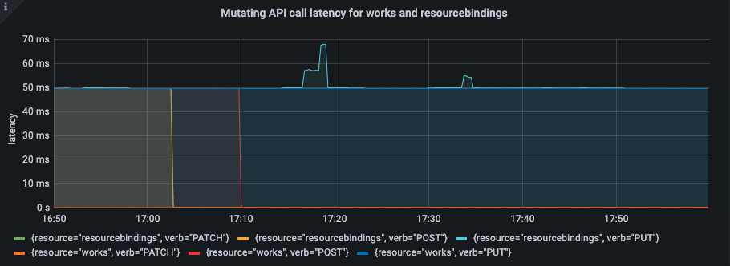

## Abstract

As Karmada is being implemented in more and more enterprises and organizations, scalability and scale of Karmada is gradually becoming new concerns for the community. In this article, we will introduce how to conduct large-scale testing for Karmada and how to monitor metrics from Karmada control plane.

## Build large scale environment

### Create member clusters using kind

#### Why kind

[Kind](https://sigs.k8s.io/kind) is a tool for running local Kubernetes clusters using Docker containers. Kind was primarily designed for testing Kubernetes itself, so it play a good role in simulating member clusters.

#### Usage

> Follow the [kind installation](https://kind.sigs.k8s.io/docs/user/quick-start#installation) guide.

Create 10 member clusters:

```shell
for ((i=1; i<=10; i ++)); do
	kind create cluster --name member$i
done;
```


### Simulate a large number of fake nodes using fake-kubelet

#### Why fake-kubelet

##### Compare to Kubemark

**Kubemark** is directly implemented with the code of kubelet, replacing the runtime part, except that it does not actually start the container, other behaviors are exactly the same as kubelet, mainly used for Kubernetes own e2e test, simulating a large number of nodes and pods will **occupy the same memory as the real scene**.

**Fake-kubelet** is a tool used to simulate any number of nodes and maintain pods on those nodes. It only does the minimum work of maintaining nodes and pods, so that it is very suitable for simulating a large number of nodes and pods for pressure testing on the control plane.

#### Usage

Deploy the fake-kubelet:

> Note:  Set container ENV `GENERATE_REPLICAS` in fake-kubelet deployment to set node replicas you want to create

```shell
export GENERATE_REPLICAS=your_replicas
curl https://raw.githubusercontent.com/wzshiming/fake-kubelet/master/deploy.yaml > fakekubelet.yml
# GENERATE_REPLICAS default value is 5
sed -i "s/5/$GENERATE_REPLICAS/g" fakekubelet.yml 
kubectl apply -f fakekubelet.yml
```


`kubectl get node` You will find fake nodes.

```shell
> kubectl get node -o wide
NAME         STATUS   ROLES   AGE   VERSION   INTERNAL-IP   EXTERNAL-IP   OS-IMAGE    KERNEL-VERSION   CONTAINER-RUNTIME
fake-0       Ready    agent   10s   fake      10.88.0.136   <none>        <unknown>   <unknown>        <unknown>
fake-1       Ready    agent   10s   fake      10.88.0.136   <none>        <unknown>   <unknown>        <unknown>
fake-2       Ready    agent   10s   fake      10.88.0.136   <none>        <unknown>   <unknown>        <unknown>
fake-3       Ready    agent   10s   fake      10.88.0.136   <none>        <unknown>   <unknown>        <unknown>
fake-4       Ready    agent   10s   fake      10.88.0.136   <none>        <unknown>   <unknown>        <unknown>
```

Deploy an sample deployment to test:

```shell
> kubectl apply -f - <<EOF
apiVersion: apps/v1
kind: Deployment
metadata:
  name: fake-pod
  namespace: default
spec:
  replicas: 4
  selector:
    matchLabels:
      app: fake-pod
  template:
    metadata:
      labels:
        app: fake-pod
    spec:
      affinity:
        nodeAffinity:
          requiredDuringSchedulingIgnoredDuringExecution:
            nodeSelectorTerms:
              - matchExpressions:
                  - key: type
                    operator: In
                    values:
                      - fake-kubelet
      tolerations: # A taints was added to an automatically created Node. You can remove taints of Node or add this tolerations
        - key: "fake-kubelet/provider"
          operator: "Exists"
          effect: "NoSchedule"
      # nodeName: fake-0 # Or direct scheduling to a fake node
      containers:
        - name: fake-pod
          image: fake
EOF
```

`kubectl get pod` You will find that it has been started, although the image does not exist.

```shell
> kubectl get pod -o wide
NAME                        READY   STATUS    RESTARTS   AGE   IP          NODE     NOMINATED NODE   READINESS GATES
fake-pod-78884479b7-52qcx   1/1     Running   0          6s    10.0.0.23   fake-4   <none>           <none>
fake-pod-78884479b7-bd6nk   1/1     Running   0          6s    10.0.0.13   fake-2   <none>           <none>
fake-pod-78884479b7-dqjtn   1/1     Running   0          6s    10.0.0.15   fake-2   <none>           <none>
fake-pod-78884479b7-h2fv6   1/1     Running   0          6s    10.0.0.31   fake-0   <none>           <none>
```


## Distribute resources using CLusterLoader2

### ClusterLoader2

[ClusterLoader2](https://github.com/kubernetes/perf-tests/tree/master/clusterloader2) is an open source Kubernetes cluster testing tool. It tests against Kubernetes-defined SLIs/SLOs metrics to verify that clusters meet various quality of service standards. ClusterLoader2 is a tool oriented single cluster, it is complex to test karmada control plane meanwhile distribute resouces to member clusters. Therefore, we just use the ClusterLoader2 to distribute resources to clusters managed by karmada.

### Prepare a simple config

Let's prepare our config (config.yaml) to distribute resources. This config will:

- Create 10 namespace

- Create 20 deployments with 1000 pods inside that namespace


We will create file `config.yaml` that describes this test. First we need to start with defining test name:

```yaml
name: test
```

ClusterLoader2 will create namespaces automatically, but we need to specify how many namespaces we want and whether delete the namespaces after distributing resources:

```yaml
namespace:
  number: 10
  deleteAutomanagedNamespaces: false
```

Next, we need to specify TuningSets. TuningSet describes how actions are executed. The qps means 1/qps s per action interval. In order to distribute resources slowly to relieve the pressure on the apiserver, the qps of Uniformtinyqps is set to 0.1, which means that after distributing a deployment, we wait 10s before continuing to distribute the next deployment.

```yaml
tuningSets:
- name: Uniformtinyqps
  qpsLoad:
    qps: 0.1
- name: Uniform1qps
  qpsLoad:
    qps: 1
```

Finally, we will create a phase that creates deployment and propagation policy. We need to specify in which namespaces we want the deployment and propagation policy to be created, how many of these deployments per namespace. Also, we will need to specify template for our deployment and propagation policy , which we will do later. For now, let's assume that this template allows us to specify numbers of replicas in deployment and propagation policy.

```yaml
steps:
- name: Create deployment
  phases:
  - namespaceRange:
      min: 1
      max: 10
    replicasPerNamespace: 20
    tuningSet: Uniformtinyqps
    objectBundle:
    - basename: test-deployment
      objectTemplatePath: "deployment.yaml"
      templateFillMap:
        Replicas: 1000
  - namespaceRange:
      min: 1
      max: 10
    replicasPerNamespace: 1
    tuningSet: Uniform1qps
    objectBundle:
    - basename: test-policy
      objectTemplatePath: "policy.yaml"
      templateFillMap:
        Replicas: 1
        
```

The whole `config.yaml` will look like this:

```yaml
name: test

namespace:
  number: 10
  deleteAutomanagedNamespaces: false
  
tuningSets:
- name: Uniformtinyqps
  qpsLoad:
    qps: 0.1
- name: Uniform1qps
  qpsLoad:
    qps: 1

steps:
- name: Create deployment 
  phases:
  - namespaceRange:
      min: 1
      max: 10
    replicasPerNamespace: 20
    tuningSet: Uniformtinyqps
    objectBundle:
    - basename: test-deployment
      objectTemplatePath: "deployment.yaml"
      templateFillMap:
        Replicas: 1000
  - namespaceRange:
      min: 1
      max: 10
    replicasPerNamespace: 1
    tuningSet: Uniform1qps
    objectBundle:
    - basename: test-policy
      objectTemplatePath: "policy.yaml"
```


Now, we need to specify deployment and propagation template. ClusterLoader2 by default adds parameter `Name` that you can use in your template. In our config, we also passed `Replicas` parameter. So our template for deployment and propagation policy will look like following:

```yaml
# deployment.yaml
apiVersion: apps/v1
kind: Deployment
metadata:
  name: {{.Name}}
  labels:
    group: test-deployment
spec:
  replicas: {{.Replicas}}
  selector:
    matchLabels:
      app: fake-pod
  template:
    metadata:
      labels:
        app: fake-pod
    spec:
      affinity:
        nodeAffinity:
          requiredDuringSchedulingIgnoredDuringExecution:
            nodeSelectorTerms:
              - matchExpressions:
                  - key: type
                    operator: In
                    values:
                      - fake-kubelet
      tolerations: # A taints was added to an automatically created Node. You can remove taints of Node or add this tolerations
          - key: "fake-kubelet/provider"
            operator: "Exists"
            effect: "NoSchedule"
      containers:
        - image: fake-pod
          name: {{.Name}}
```

```yaml
# policy.yaml
apiVersion: policy.karmada.io/v1alpha1
kind: PropagationPolicy
metadata:
  name: test
spec:
  resourceSelectors:
    - apiVersion: apps/v1
      kind: Deployment
  placement:
    replicaScheduling:
      replicaDivisionPreference: Weighted
      replicaSchedulingType: Divided
```


### Start Distributing

To distributing resources,  run:

```shell
export KARMADA_APISERVERCONFIG=your_config
export KARMADA_APISERVERIP=your_ip
cd clusterloader2/
go run cmd/clusterloader.go --testconfig=config.yaml --provider=local --kubeconfig=$KARMADA_APISERVERCONFIG --v=2 --k8s-clients-number=1 --skip-cluster-verification=true --masterip=$KARMADA_APISERVERIP --enable-exec-service=false
```

The meaning of args above shows as following:

- k8s-clients-number: the number of karmada apiserver client number.
- skip-cluster-verification: whether to skip the cluster verification, which expects at least one schedulable node in the cluster.
- enable-exec-service: whether to enable exec service that allows executing arbitrary commands from a pod running in the cluster.

Since the resources of member cluster cannot be accessed in karmada control plane, we have to turn off enable-exec-service and cluster-verification.

> Note: If the `deleteAutomanagedNamespaces` parameter in config file is set to true, when the whole distribution of resources is complete, the resources will be immediately deleted.

## Monitor Karmada control plane using Prometheus and Grafana

### Deploy Prometheus and Grafana

> Follow the [Prometheus and Grafana Deploy Guide](https://karmada.io/docs/administrator/monitoring/working-with-prometheus-in-control-plane)

### Create Grafana DashBoards to observe Karmada control plane metrics

Here's an example to monitor the mutating api call latency for works and resourcebindings of the karmada apiserver through grafana. Monitor the metrics you want by modifying the Query statement.

#### Create a dashboard

> Follw the [Grafana support For Prometheus](https://prometheus.io/docs/visualization/grafana/)  document.

#### Modify Query Statement

Enter the following Prometheus expression into the ` Query` field.

````sql
histogram_quantile(0.99, sum(rate(apiserver_request_duration_seconds_bucket{verb!="WATCH|GET|LIST", resource~="works|resourcebindings"}[5m])) by (resource, verb, le))
````

The gragh will show as follow:




