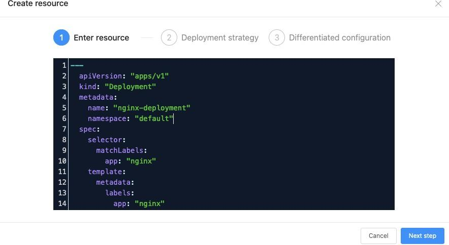
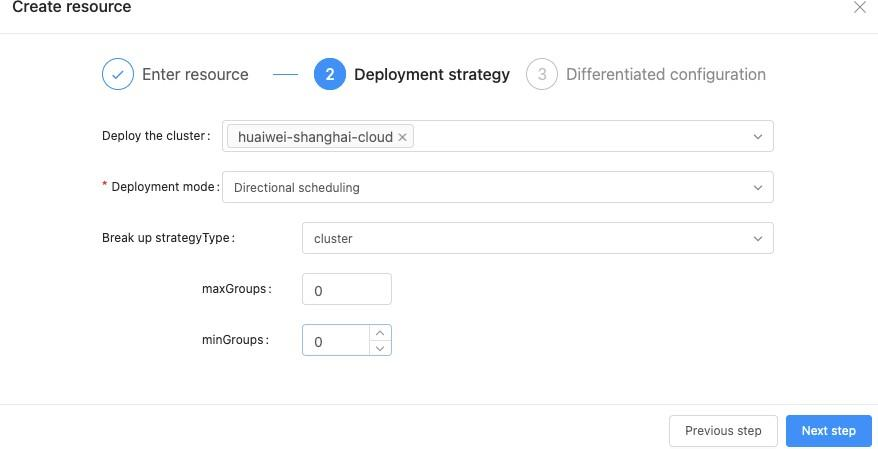
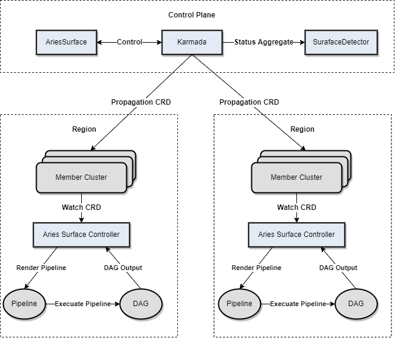

## Background

AIML INSTITUTE is a tech company that helps enterprises build integrated cloud native solutions for 
digital transformation. Their featured product is MSP Cloud Native Application Platform, which focuses 
on cloud native, data intelligence, and application security/performance/intelligence. The platform 
provides tailored cloud native, big data, AI, and information security services, covering the entire
lifecycle from development, running, to operations.

Built on Kubernetes, their platform is cloud-vendor-independent. Customers can host service applications
without regard for vendor differences. Their customers are demanding more and more on multi-cloud, 
and the scale and number of clusters and the O&M complexity grow sharply, they needed to find a way to 
satisfy their customers. They researched, compared, and tested open source projects and self-development 
proposals. AIML INSTITUTE finally chose Karmada. The following describes the reasons for selecting Karmada
and how it is implemented.

## Multi-Cluster Solution Selection

Currently, AIML INSTITUTE has about 50+ self-built clusters, each with hundreds to thousands of nodes. 
These clusters are heterogeneous. Some clusters contain heterogeneous compute resources such as GPUs, 
and some edge clusters are built using K3s. Therefore, AIML INSTITUTE selects the multi-cluster solution
based on the following principles.

- The cluster API definition must be abstract and flexible enough to describe the cluster statuses, resources, and members. Only a thin glue layer is required for heterogeneous members in a cluster and heterogeneous clusters.
- The solution must be compatible with Kubernetes native APIs and CRDs. In this way, existing systems can be migrated to multi-cluster environments with no or little code refactoring.
- The solution must support multi-cluster resource scheduling policies and customized scaling capabilities, because clusters scattered around the world need to be managed on a unified platform.
- The control plane must has high availability and performance, so that the multi-cluster system can be horizontally expanded as the scale increases.
  Why Karmada? First, Karmada is compatible with Kubernetes native APIs and CRDs. Second, the architecture of Karmada is similar to that of Kubernetes. Both are progressive and scalable. What's more, Karmada has unique advantages than other Kubernetes projects:
- **Independent etcd cluster:** Karmada enables the control plane to provide storage for more resources without impacting Kubernetes clusters, and will allow further separation of large-sized resource objects on the control plane for larger-scale management.
- **Independent scheduler:** Karmada uses an independent scheduler to realize multi-cluster scheduling.
- **Agent/Non-agent access:** Compared with the all-in-one system on the control plane, the agent/non-agent access fits more scenarios. The following figure shows the Karmada architecture.

****

## Karmada Implementation

## Multi-Cluster Management

When clusters grow in both scale and differences in versions, configurations, compute resources, and API resources, the management complexity increases significantly. An automated system can be the solution. Based on the cluster CRD defined by Karmada, AIML INSTITUTE automates multi-cluster management to unburden system administrators.

### Streamlining Cluster Management

Karmada provides two cluster synchronization modes for the collaboration between the Karmada control plane and member clusters.

1. **Push mode:** The Karmada control plane directly manages member clusters and syncs resources. Users only need to register member clusters with the Karmada control plane and do not need to deploy additional components.

2. **Pull mode:** Member clusters proactively pull resources from the Karmada control plane and sync their states. Users only need to deploy the karmada-agent component in member clusters, and the component automatically registers clusters.
   Working principles:

| Karmada Control Plane | Member Cluster                 | Synchronization Mode |
|-----------------------|--------------------------------|----------------------|
| Public cloud          | Private cloud                  | Pull                 |
| Public cloud          | Public cloud (public network)  | Pull                 |
| Public cloud          | Public cloud (private network) | Push                 |

### Automating Cluster Management

Adding a Kubernetes cluster is complex, involving cluster creation, verification and registration, 
as well as cross-department collaboration. AIML INSTITUTE adds service-related management policies. 
Here the hybrid cloud system manages the cloud and on-premises IaaS resources.

### Integrating Karmada to the Existing Platform

AIML INSTITUTE integrates the preceding functions with its cloud platform to simplify system O&M and 
administrator operations.

## Multi-Cluster Resource Management and Scheduling

If a multi-cluster project uses CRDs to encapsulate Kubernetes native APIs, they will be difficult to 
interconnect with existing systems, requiring heavy reconstruction workload. What's worse, this exposes 
the complexity of resource management and scheduling to users and system O&M personnel. Karmada is 
surprisingly helpful to solve this issue. As a multi-cluster container orchestration project that is 
fully compatible with Kubernetes native APIs, Karmada allows users to propagate existing cluster 
resources to multiple clusters without any modification. It takes care of the complexity of multi-cluster
resource management and scheduling. The following figure shows the Karmada API workflow:

This workflow implements the design of separating mechanisms from policies. Karmada defines a multi-cluster
resource management mechanism and related policies. It provides propagation policies for system 
administrators to define resource propagation across clusters, and override policies to define the 
differentiated configurations of multiple clusters. End users only need to submit their Kubernetes native 
API declarations. The following figure shows how AIML INSTITUTE integrates this mechanism into its platform.

### Advanced Scheduling Policies

Different from other multi-cluster systems, Karmada supports many advanced scheduling policies:

- **Directional:** Similar to scheduling pods to nodes in Kubernetes, this mode schedules deployed resources to specified clusters.
- **Affinity:** Similar to that in Kubernetes, this mode supports syntax such as label selector and match expression.
- **Taints and tolerations:** Similar to those of Kubernetes. Karmada cluster APIs declare taints of clusters. If a resource can tolerate the taints of a cluster, it can be scheduled to the cluster. In addition, Karmada implements a scheduler framework similar to that of Kubernetes. When the default scheduling policies do not meet requirements, AIML INSTITUTE customizes scheduling policies as a supplement. Karmada also provides a **SchedulerName** field in propagation policies to determine which scheduler to use. The field can replace the default scheduler to meet higher scheduling requirements in complex scenarios. In summary, Karmada supports flexible scheduling policies, on-demand scaling, and multi-scheduler architecture. These capabilities satisfy AIML INSTITUTE and are available to users in two ways:

1. **Templates**: After filling in the Kubernetes native API declaration, users can select a system-created template to declare these scheduling policies. Thanks to Karmada, the system also supports template CRUD.
2. **Strategies**: Capabilities are visualized for users to select, as shown below.

### Differentiated Resource Configurations for Multiple Clusters

Workload configurations (for example, container image tags) of multiple clusters are often different. AIML INSTITUTE encapsulates Karmada's override policies for users, as shown in the following figure:

### Multi-Cluster Resource State Aggregation

Resources run in multiple clusters. It is critical to aggregate their states to form a unified view. Karmada aggregates states of native Kubernetes resources, which are used to build the platform as follows:

## Integration of Karmada and Existing Systems

It's easy to integrate Karmada with AIML INSTITUTE's existing systems. AriesSurface is the first project that AIML INSTITUTE tries to migrate from a single to multiple clusters. AriesSurface is a pipeline (DAG)-based inspection system used to detect deployment links and cluster data consistency, which are two critical metrics of clusters. With Karmada, AriesSurface is reconstructed into a multi-cluster inspection system that can observe the states of clusters globally. The following figure shows its new architecture:

1. The inspection system delivers CRDs to member clusters through Karmada propagation.
2. The surface controllers of member clusters listen to CRD creation, render a pipeline based on the definition, and calculate DAGs. The controllers execute the DAGs and generate the inspection results.
3. The control plane runs a detector to collect, aggregate, and calculate the inspection results. Perceptible link states of member clusters allow more effective cross-cluster deployment and scheduling. The following figure shows the Cluster Inspection page in the online system.
   
   

4. The inspection system also draws the time sequence states of the inspected links at different time points for tracing exceptions.

## Integration of Karmada and Community Ecosystem

Karmada's design makes it easy to integrate with other community projects. The following figure shows the architecture of integrating Karmada with Velero for multi-cluster backup and restore. The multi-cluster backup and restore CRDs of Velero are added to the Karmada control plane, and propagated to specified member clusters according to the Karmada propagation policies. The Backup and Restore controllers reconcile the states and aggregate the CRD states of Velero in the member clusters.

## Karmada for Multi-cluster Heterogeneous Resources

The following figure shows how to manage multi-cluster GPU resources based on Karmada.

On Karmada, AIML INSTITUTE quickly built a prototype system for multi-cluster GPU resource management. A time-based sharing model is used to virtualize the GPU compute capacity at the bottom layer. Multiple pods on the same node can share one or more GPU cards. The GPU agent of each node implements the GPU device plugin and registers the virtualized GPU cores and GPU memory as extended resources. GPU Scheduler, a Kubernetes scheduler plugin in Karmada, schedules extended resources. A basic idea of multi-cluster GPU management is to unify the GPU resource view and scheduling. Users submit GPU-related workloads and propagation policies, based on which GPU Scheduler performs a simple scheduling. GPU Scheduler also collects the GPU resource information of each member cluster to perform two-layer scheduling.

## Summary

Karmada brings in the following benefits for AIML INSTITUTE in multi-cluster management:

1. Existing resource definitions can be migrated into multi-cluster environment without modification, owing to Karmada's compatibility with Kubernetes native APIs.
2. Based on the Karmada cluster APIs, Cluster Controllers, and pull/push modes, a multi-cluster control standard is established for unified output of the multi-cluster management capabilities of any upper-layer system.
3. Scenario-specific multi-cluster resource scheduling and orchestration are realized based on Karmada's built-in controllers, scheduler plugins, and extended scheduler equivalent to that of Kubernetes.
4. The flexible architecture design of Karmada enables the existing single-cluster systems to be quickly switched to multi-cluster ones.
   AIML INSTITUTE has witnessed the growth of Karmada. From Karmada v0.5 to v1.0, AIML INSTITUTE has participated in almost every weekly meeting and witnessed many exciting features from proposal to merge. Two members of the team have become Karmada members. This is a virtuous cycle between open source projects and commercial companies. Karmada helps AIML INSTITUTE build systems and AIML INSTITUTE feeds back problems and new ideas to the community. During this process, the team gets a deeper understanding of open source while contributing to the community. More developers are welcomed to participate in the community.
   