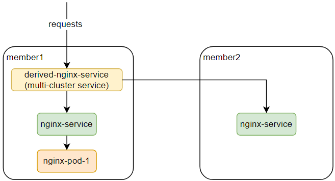

In Karmada, a FederatedHPA scales up/down the workload's replicas across multiple clusters, with the aim of automatically scaling the workload to match the demand.

When the load is increase, FederatedHPA scales up the replicas of the workload(the Deployment, StatefulSet, or other similar resource) if the number of Pods is under the configured maximum. When the load is decrease, FederatedHPA scales down the replicas of the workload if the number of Pods is above the configured minimum.

This document walk you through an example of enabling FederatedHPA to automatically manage scale for a cross-cluster deployed nginx.

The walkthrough example will do as follows:  

* One deployment's pod exists in `member1` cluster.
* The service is deployed in `member1` and `member2` cluster.
* Request the multi-cluster service and trigger the pod's CPU usage increases.
* The replicas will be scaled up in `member1` and `member2` cluster.

## Prerequisites

### Karmada has been installed

We can install Karmada by referring to [Quick Start](https://github.com/karmada-io/karmada#quick-start), or directly run `hack/local-up-karmada.sh` script which is also used to run our E2E cases.

### Member Cluster Network

Ensure that at least two clusters have been added to Karmada, and the container networks between member clusters are connected.

- If you use the `hack/local-up-karmada.sh` script to deploy Karmada, Karmada will have three member clusters, and the container networks of the `member1` and `member2` will be connected.
- You can use `Submariner` or other related open source projects to connect networks between member clusters.

> Note: In order to prevent routing conflicts, Pod and Service CIDRs of clusters need non-overlapping.

### The ServiceExport and ServiceImport CRDs have been installed

We need to install `ServiceExport` and `ServiceImport` in the member clusters to enable multi-cluster service.

After `ServiceExport` and `ServiceImport` have been installed on the **Karmada Control Plane**, we can create `ClusterPropagationPolicy` to propagate those two CRDs to the member clusters.

```yaml
# propagate ServiceExport CRD
apiVersion: policy.karmada.io/v1alpha1
kind: ClusterPropagationPolicy
metadata:
  name: serviceexport-policy
spec:
  resourceSelectors:
    - apiVersion: apiextensions.k8s.io/v1
      kind: CustomResourceDefinition
      name: serviceexports.multicluster.x-k8s.io
  placement:
    clusterAffinity:
      clusterNames:
        - member1
        - member2
---        
# propagate ServiceImport CRD
apiVersion: policy.karmada.io/v1alpha1
kind: ClusterPropagationPolicy
metadata:
  name: serviceimport-policy
spec:
  resourceSelectors:
    - apiVersion: apiextensions.k8s.io/v1
      kind: CustomResourceDefinition
      name: serviceimports.multicluster.x-k8s.io
  placement:
    clusterAffinity:
      clusterNames:
        - member1
        - member2
```

### metrics-server has been installed in member clusters

We need to install `metrics-server` for member clusters to provider the metrics API, install it by running:
```sh
hack/deploy-k8s-metrics-server.sh ${member_cluster_kubeconfig} ${member_cluster_context_name} 
```

If you use the `hack/local-up-karmada.sh` script to deploy Karmada, you can run following command to deploy `metrics-server` in all three member clusters:
```sh
hack/deploy-k8s-metrics-server.sh $HOME/.kube/members.config member1
hack/deploy-k8s-metrics-server.sh $HOME/.kube/members.config member2
hack/deploy-k8s-metrics-server.sh $HOME/.kube/members.config member3
```

### karmada-metrics-adapter has been installed in Karmada control plane

We need to install `karmada-metrics-adapter` in Karmada control plane to provide the metrics API, install it by running:
```sh
hack/deploy-metrics-adapter.sh ${host_cluster_kubeconfig} ${host_cluster_context} ${karmada_apiserver_kubeconfig} ${karmada_apiserver_context_name}
```

If you use the `hack/local-up-karmada.sh` script to deploy Karmada, `karmada-metrics-adapter` will be installed by default.

## Deploy workload in `member1` and `member2` cluster

We need to deploy deployment(1 replica) and service in `member1` and `member2`.

```yaml
apiVersion: apps/v1
kind: Deployment
metadata:
  name: nginx
  labels:
    app: nginx
spec:
  replicas: 1
  selector:
    matchLabels:
      app: nginx
  template:
    metadata:
      labels:
        app: nginx
    spec:
      containers:
      - image: nginx
        name: nginx
        resources:
          requests:
            cpu: 25m
            memory: 64Mi
          limits:
            cpu: 25m
            memory: 64Mi
---
apiVersion: v1
kind: Service
metadata:
  name: nginx-service
spec:
  ports:
  - port: 80
    targetPort: 80
  selector:
    app: nginx
---
apiVersion: policy.karmada.io/v1alpha1
kind: PropagationPolicy
metadata:
  name: nginx-propagation
spec:
  resourceSelectors:
    - apiVersion: apps/v1
      kind: Deployment
      name: nginx
    - apiVersion: v1
      kind: Service
      name: nginx-service
  placement:
    clusterAffinity:
      clusterNames:
        - member1
        - member2
    replicaScheduling:
      replicaDivisionPreference: Weighted
      replicaSchedulingType: Divided
      weightPreference:
        staticWeightList:
          - targetCluster:
              clusterNames:
                - member1
            weight: 1
          - targetCluster:
              clusterNames:
                - member2
            weight: 1
```

After deploying, you can check the distribution of the pods and service:
```sh
$ karmadactl get pods
NAME                     CLUSTER   READY   STATUS    RESTARTS   AGE
nginx-777bc7b6d7-mbdn8   member1   1/1     Running   0          9h
$ karmadactl get svc
NAME                    CLUSTER   TYPE        CLUSTER-IP      EXTERNAL-IP   PORT(S)   AGE   ADOPTION
nginx-service           member1   ClusterIP   10.11.216.215   <none>        80/TCP    9h    Y
nginx-service           member2   ClusterIP   10.13.46.61     <none>        80/TCP    9h    Y

```

## Deploy FederatedHPA in Karmada control plane

Then let's deploy FederatedHPA in Karmada control plane.

```yaml
apiVersion: autoscaling.karmada.io/v1alpha1
kind: FederatedHPA
metadata:
  name: nginx
spec:
  scaleTargetRef:
    apiVersion: apps/v1
    kind: Deployment
    name: nginx
  minReplicas: 1
  maxReplicas: 10
  behavior:
    scaleDown:
      stabilizationWindowSeconds: 10
    scaleUp:
      stabilizationWindowSeconds: 10
  metrics:
    - type: Resource
      resource:
        name: cpu
        target:
          type: Utilization
          averageUtilization: 10
```

After deploying, you can check the FederatedHPA:
```sh
$ kubectl --kubeconfig $HOME/.kube/karmada.config --context karmada-apiserver get fhpa
NAME    REFERENCE-KIND   REFERENCE-NAME   MINPODS   MAXPODS   REPLICAS   AGE
nginx   Deployment       nginx            1         10        1          9h
```

## Export service to `member1` cluster

As mentioned before, we need a multi-cluster service to route the requests to the pods in `member1` and `member2` cluster, so let create this mult-cluster service.  
* Create a `ServiceExport` object on Karmada Control Plane, and then create a `PropagationPolicy` to propagate the `ServiceExport` object to `member1` and `member2` cluster.
  ```yaml
  apiVersion: multicluster.x-k8s.io/v1alpha1
  kind: ServiceExport
  metadata:
    name: nginx-service
  ---
  apiVersion: policy.karmada.io/v1alpha1
  kind: PropagationPolicy
  metadata:
    name: serve-export-policy
  spec:
    resourceSelectors:
      - apiVersion: multicluster.x-k8s.io/v1alpha1
        kind: ServiceExport
        name: nginx-service
    placement:
      clusterAffinity:
        clusterNames:
          - member1
          - member2
  ```
* Create a `ServiceImport` object on Karmada Control Plane, and then create a `PropagationPolicy` to propagate the `ServiceImport` object to `member1` cluster.
  ```yaml
  apiVersion: multicluster.x-k8s.io/v1alpha1
  kind: ServiceImport
  metadata:
    name: nginx-service
  spec:
    type: ClusterSetIP
    ports:
    - port: 80
      protocol: TCP
  ---
  apiVersion: policy.karmada.io/v1alpha1
  kind: PropagationPolicy
  metadata:
    name: serve-import-policy
  spec:
    resourceSelectors:
      - apiVersion: multicluster.x-k8s.io/v1alpha1
        kind: ServiceImport
        name: nginx-service
    placement:
      clusterAffinity:
        clusterNames:
          - member1
  ```

After deploying, you can check the multi-cluster service:
```sh
$ karmadactl get svc
NAME                    CLUSTER   TYPE        CLUSTER-IP      EXTERNAL-IP   PORT(S)   AGE   ADOPTION
derived-nginx-service   member1   ClusterIP   10.11.59.213    <none>        80/TCP    9h    Y
```

## Install hey http load testing tool in member1 cluster

In order to do http requests, here we use `hey`.
* Download `hey` and copy it to kind cluster container.
```
$ wget https://hey-release.s3.us-east-2.amazonaws.com/hey_linux_amd64
$ chmod +x hey_linux_amd64
$ docker cp hey_linux_amd64 member1-control-plane:/usr/local/bin/hey
```

## Test scaling up

* Check the pod distribution firstly.
  ```sh
  $ karmadactl get pods
  NAME                     CLUSTER   READY   STATUS      RESTARTS   AGE
  nginx-777bc7b6d7-mbdn8   member1   1/1     Running     0          61m
  ```

* Check multi-cluster service ip.
  ```sh
  $ karmadactl get svc
  NAME                    CLUSTER   TYPE        CLUSTER-IP        EXTERNAL-IP   PORT(S)   AGE   ADOPTION
  derived-nginx-service   member1   ClusterIP   10.11.59.213      <none>        80/TCP    20m   Y
  ```

* Request multi-cluster service with hey to increase the nginx pods' CPU usage.
  ```sh
  $ docker exec member1-control-plane hey -c 1000 -z 1m http://10.11.59.213
  ```

* Wait 15s, the replicas will be scaled up, then you can check the pod distribution again.
  ```sh
  $ karmadactl get pods -l app=nginx
  NAME                     CLUSTER   READY   STATUS      RESTARTS   AGE
  nginx-777bc7b6d7-c2cfv   member1   1/1     Running     0          22s
  nginx-777bc7b6d7-mbdn8   member1   1/1     Running     0          62m
  nginx-777bc7b6d7-pk2s4   member1   1/1     Running     0          37s
  nginx-777bc7b6d7-tbb4k   member1   1/1     Running     0          37s
  nginx-777bc7b6d7-znlj9   member1   1/1     Running     0          22s
  nginx-777bc7b6d7-6n7d9   member2   1/1     Running     0          22s
  nginx-777bc7b6d7-dfbnw   member2   1/1     Running     0          22s
  nginx-777bc7b6d7-fsdg2   member2   1/1     Running     0          37s
  nginx-777bc7b6d7-kddhn   member2   1/1     Running     0          22s
  nginx-777bc7b6d7-lwn52   member2   1/1     Running     0          37s
  
  ```

## Test scaling down

After 1 minute, the load testing tool will be stopped, then you can see the workload is scaled down across clusters.
```sh
$ karmadactl get pods -l app=nginx
NAME                     CLUSTER   READY   STATUS    RESTARTS   AGE
nginx-777bc7b6d7-mbdn8   member1   1/1     Running   0          64m
```
