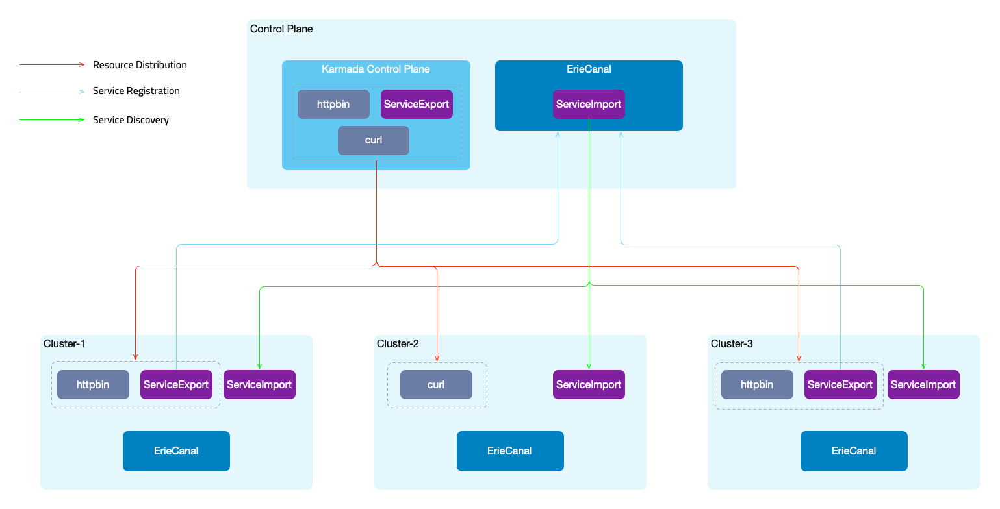

Kubernetes has emerged as a foundational technology in modern application architecture, widely adopted by enterprises as a container orchestration system. As cloud computing gains traction and businesses expand, the adoption of multi-cloud and hybrid cloud architectures is on the rise. Consequently, the number of Kubernetes clusters is increasing accordingly.

Enter Karmada, a powerful tool that simplifies cross-region and cross-cloud application deployment. By deploying multiple instances of the same service across multiple Kubernetes clusters, system availability and flexibility are significantly enhanced. However, the interdependencies between services necessitate their deployment within the same cluster to ensure seamless interaction and functional integrity. This interdependence creates a complex network of tightly coupled services, resembling an intricate vine, challenging the separation of various system components. Traditional service deployment often requires a full-scale approach, leading to suboptimal resource utilization and higher operational costs.

In this article, we will explore how [ErieCanal](https://github.com/flomesh-io/ErieCanal) can empower organizations to achieve interconnection and service governance across multiple Karmada clusters. This comprehensive solution enables efficient cross-cluster service management and establishes a foundation for robust distributed systems.

ErieCanal is an implementation of Multi-Cluster Service (MCS) that provides MCS, Ingress, Egress, and GatewayAPI for Kubernetes clusters.

## Overall Architecture

In this example, we utilize Karmada for cross-cluster scheduling of resources and ErieCanal for cross-cluster service registration and discovery.

- Service Registration: By creating a [`ServiceExport`](https://github.com/flomesh-io/ErieCanal/blob/7fc7e33315347ec69dc60ff19fdeb1cd1552ef34/apis/serviceexport/v1alpha1/serviceexport_types.go#L125) resource, services are declared as multi-cluster services and registered with the ErieCanal control plane. Additionally, ingress rules are created for the service.
- Service Discovery: The ErieCanal control plane utilizes the service information and information about the cluster where it resides to create a [`ServiceImport`](https://github.com/flomesh-io/ErieCanal/blob/7fc7e33315347ec69dc60ff19fdeb1cd1552ef34/apis/serviceimport/v1alpha1/serviceimport_types.go#L160) resource. This resource is then synchronized across all member clusters.

ErieCanal runs on both the control plane cluster and the member clusters. Member clusters need to be registered with the control plane cluster. ErieCanal is an independent component and does not need to run on the Karmada control plane. ErieCanal is responsible for multi-cluster service registration and discovery, while Karmada handles multi-cluster resource scheduling.



Once the services are registered and discovered across clusters, automatic traffic shifting needs to be performed when accessing applications (curl -> httpbin). There are two possible approaches:

- Integration with the service mesh [FSM (Flomesh Service Mesh)](https://flomesh.io/fsm/) to achieve traffic shifting based on policies. In addition to obtaining service access information from Kubernetes Service, information from the ServiceImport of multi-cluster resources is also used.
- Using the ErieCanal component ErieCanalNet (to be released soon) to manage cross-cluster traffic using eBPF+sidecar (Node level).

The following steps outline the complete demonstration process. You can also use the provided [flomesh.sh script](../../resources/userguide/service/eriecanal/flomesh.sh) for an automated demonstration. Before using the script, **ensure that Docker and kubectl are already installed, and at least 8G RAM**. Here are the usage options for the script:

- `flomesh.sh` - Executes the script without any parameters, which will create four clusters, set up the environment (install Karmada, ErieCanal, FSM), and run the example.
- `flomesh.sh -h` - Displays the explanation of the parameters.
- `flomesh.sh -i` - Creates clusters and sets up the environment.
- `flomesh.sh -d` - Runs the example.
- `flomesh.sh -r` - Deletes the namespace where the example resides.
- `flomesh.sh -u` - Destroys the clusters.

The following is a step-by-step guide, consistent with the execution steps of the flomesh.sh script.

## Prerequisites

- Four clusters: control-plane, cluster-1, cluster-2, cluster-3
- Docker
- k3d
- helm
- kubectl

## Environment Setup

### 1. Install Karmada Control Plane

Refer to the [Karmada documentation](https://karmada.io/docs/install/) to install the Karmada control plane. After initializing Karmada, register the **three member clusters**, clutser-1, cluster-2, and cluster-3, with the Karmada control plane. You can refer to the [Karmada cluster registration guide](https://karmada.io/docs/userguide/clustermanager/cluster-registration/) for instructions.

Here is an example command for cluster registration using the push mode (execute on the control-plane cluster):

```shell
karmadactl --kubeconfig PATH_TO_KARMADA_CONFIG join CLUSTER_NAME --cluster-kubeconfig=PATH_CLSUTER_KUBECONFIG
```

Next, you need to register the multi-cluster CRDs of ErieCanal with the Karmada control plane.

```shell
kubectl --kubeconfig PATH_TO_KARMADA_CONFIG apply -f https://raw.githubusercontent.com/flomesh-io/ErieCanal/main/charts/erie-canal/apis/flomesh.io_clusters.yaml
kubectl --kubeconfig PATH_TO_KARMADA_CONFIG apply -f https://raw.githubusercontent.com/flomesh-io/ErieCanal/main/charts/erie-canal/apis/flomesh.io_mcs-api.yaml
```

In the control-plane cluster, you can use the Karmada API server's configuration to view the cluster registration information.

```shell
kubectl --kubeconfig PATH_TO_KARMADA_CONFIG get cluster
NAME        VERSION        MODE   READY   AGE
cluster-1   v1.23.8+k3s2   Push   True    154m
cluster-2   v1.23.8+k3s2   Push   True    154m
cluster-3   v1.23.8+k3s2   Push   True    154m
```

### 2. Install ErieCanal

Next, you need to install ErieCanal on **all clusters**. It is recommended to use Helm for installation. You can refer to the [ErieCanal installation documentation](https://github.com/flomesh-io/ErieCanal#install) for more details.

```shell
helm repo add ec https://ec.flomesh.io --force-update
helm repo update

EC_NAMESPACE=erie-canal
EC_VERSION=0.1.3

helm upgrade -i --namespace ${EC_NAMESPACE} --create-namespace --version=${EC_VERSION} --set ec.logLevel=5 ec ec/erie-canal
```

After the installation is complete, register the **three member clusters** with the ErieCanal control plane. Use the following command on the control-plane cluster:

`CLUSTER_NAME=<member_cluster_name>`

`HOST_IP=<member_cluster_entry_ip>`

`PORT=<member_cluster_entry_port>`

`KUBECONFIG=<member_cluster_kubeconfig>`

- `CLUSTER_NAME`: member cluster name
- `HOST_IP`: member cluster entry IP
- `PORT`: member cluster entry Port
- `KUBECONFIG`: member cluster KUBECONFIG contents

```shell
kubectl apply -f - <<EOF
apiVersion: flomesh.io/v1alpha1
kind: Cluster
metadata:
  name: ${CLUSTER_NAME}
spec:
  gatewayHost: ${HOST_IP}
  gatewayPort: ${PORT}
  kubeconfig: |+
  ${KUBECONFIG}
EOF
```

After registration is completed, you can view the registration information of the member clusters in the control-plane cluster.

To view the registration information of member clusters, use the following command in the control-plane cluster:

```shell
kubectl get cluster
NAME        REGION    ZONE      GROUP     GATEWAY HOST   GATEWAY PORT   MANAGED   MANAGED AGE   AGE
local       default   default   default                  80                                     159m
cluster-1   default   default   default   10.0.2.4       80             True      159m          159m
cluster-2   default   default   default   10.0.2.5       80             True      159m          159m
cluster-3   default   default   default   10.0.2.6       80             True      159m          159m
```

### 3. Install FSM

Here, we will use an integrated service mesh, FSM, to achieve cross-cluster traffic scheduling. Next, we will install the FSM service mesh on **the three member clusters**. FSM provides two installation methods: CLI and Helm. In this case, we will use the CLI method.

First, download the FSM CLI:

```shell
system=$(uname -s | tr [:upper:] [:lower:])
arch=$(dpkg --print-architecture)
release=v1.0.0
curl -L https://github.com/flomesh-io/fsm/releases/download/${release}/fsm-${release}-${system}-${arch}.tar.gz | tar -vxzf -
./${system}-${arch}/fsm version
sudo cp ./${system}-${arch}/fsm /usr/local/bin/
```

Next, proceed with the FSM installation. When using multi-cluster mode, FSM requires enabling the local DNS proxy. During installation, you need to provide the address of the cluster DNS.

```shell
DNS_SVC_IP="$(kubectl get svc -n kube-system -l k8s-app=kube-dns -o jsonpath='{.items[0].spec.clusterIP}')"

fsm install \
--set=fsm.localDNSProxy.enable=true \
--set=fsm.localDNSProxy.primaryUpstreamDNSServerIPAddr="${DNS_SVC_IP}" \
```

To check the installed service mesh version and other information in the cluster, you can use the following command:

```shell
fsm version
CLI Version: version.Info{Version:"v1.0.0", GitCommit:"9966a2b031c862b54b4b007eae35ee16afa31a80", BuildDate:"2023-05-29-12:10"}

MESH NAME   MESH NAMESPACE   VERSION   GIT COMMIT                                 BUILD DATE
fsm         fsm-system       v1.0.0    9966a2b031c862b54b4b007eae35ee16afa31a80   2023-05-29-12:11
```

## Deploying Example Application

The deployment and scheduling of the application will be done through the Karmada control plane. When executing `kubectl` commands, you need to explicitly specify the configuration of the Karmada control plane API server.

```shell
alias kmd="kubectl --kubeconfig /etc/karmada/karmada-apiserver.config"
```

#### Server

Create the `httpbin` namespace. To include it in the service mesh management, we add the label `flomesh.io/monitored-by: fsm` and annotation `flomesh.io/monitored-by: fsm` when creating the namespace.

```shell
kmd apply -f - <<EOF
apiVersion: v1
kind: Namespace
metadata:
  name: httpbin
  labels:
    flomesh.io/monitored-by: fsm
  annotations:
    flomesh.io/sidecar-injection: enabled
EOF
```

Create the `httpbin` Deployment and Service in the `httpbin` namespace:

```shell
kmd apply -n httpbin -f - <<EOF
apiVersion: apps/v1
kind: Deployment
metadata:
  name: httpbin
  labels:
    app: pipy
spec:
  replicas: 2
  selector:
    matchLabels:
      app: pipy
  template:
    metadata:
      labels:
        app: pipy
    spec:
      containers:
        - name: pipy
          image: flomesh/pipy:latest
          ports:
            - containerPort: 8080
          command:
            - pipy
            - -e
            - |
              pipy()
              .listen(8080)
              .serveHTTP(() => new Message(os.env['HOSTNAME'] +'\n'))
---
apiVersion: v1
kind: Service
metadata:
  name: httpbin
spec:
  ports:
    - port: 8080
      targetPort: 8080
      protocol: TCP
  selector:
    app: pipy
EOF
```

After creating resources in the Karmada control plane, you also need to create a `PropagationPolicy` to distribute the resources. We will distribute the `Deployment` and `Service` to the member clusters `cluster-1` and `cluster-3`.

Create the `PropagationPolicy` for distributing the resources:

```shell
$kmd apply -n httpbin -f - <<EOF
apiVersion: policy.karmada.io/v1alpha1
kind: PropagationPolicy
metadata:
  name: httpbin
spec:
  resourceSelectors:
    - apiVersion: apps/v1
      kind: Deployment
      name: httpbin
    - apiVersion: v1
      kind: Service
      name: httpbin
  placement:
    clusterAffinity:
      clusterNames:
        - cluster-1
        - cluster-3
EOF
```

After deploying the application, you also need to complete the multi-cluster registration of the service. As mentioned earlier, we need to create a `ServiceExport` resource for the service to register. Similarly, when creating resources in the Karmada control plane, you also need to create propagation policies for them.

Create the `ServiceExport` resource for the service registration:

```shell
kmd apply -n httpbin -f - <<EOF
apiVersion: flomesh.io/v1alpha1
kind: ServiceExport
metadata:
  name: httpbin
spec:
  serviceAccountName: "*"
  rules:
    - portNumber: 8080
      path: "/httpbin"
      pathType: Prefix
---
apiVersion: policy.karmada.io/v1alpha1
kind: PropagationPolicy
metadata:
  name: httpbin
spec:
  resourceSelectors:
    - apiVersion: flomesh.io/v1alpha1
      kind: ServiceExport
      name: httpbin
  placement:
    clusterAffinity:
      clusterNames:
        - cluster-1
        - cluster-2
        - cluster-3
EOF
```

#### Client

Next, let's set up the client. Follow the same steps and create the `curl` namespace first.

```shell
kmd apply -f - <<EOF
apiVersion: v1
kind: Namespace
metadata:
  name: curl
  labels:
    flomesh.io/monitored-by: fsm
  annotations:
    flomesh.io/sidecar-injection: enabled
EOF
```

Deploy the `curl` application.

```shell
kmd apply -n curl -f - <<EOF
apiVersion: apps/v1
kind: Deployment
metadata:
  labels:
    app: curl
  name: curl
spec:
  replicas: 1
  selector:
    matchLabels:
      app: curl
  strategy: {}
  template:
    metadata:
      creationTimestamp: null
      labels:
        app: curl
    spec:
      containers:
      - image: curlimages/curl
        name: curl
        command:
          - sleep
          - 365d
---
apiVersion: v1
kind: Service
metadata:
  name: curl
  labels:
    app: curl
    service: curl
spec:
  ports:
    - name: http
      port: 80
  selector:
    app: curl
EOF
```

Similarly, you need to create a propagation policy for the application to schedule it to the member cluster `cluster-2`.

Create the propagation policy for the application:

```shell
kmd apply -n curl -f - <<EOF
apiVersion: policy.karmada.io/v1alpha1
kind: PropagationPolicy
metadata:
  name: curl
spec:
  resourceSelectors:
    - apiVersion: apps/v1
      kind: Deployment
      name: curl
    - apiVersion: v1
      kind: Service
      name: curl
  placement:
    clusterAffinity:
      clusterNames:
        - cluster-2
EOF
```

## Testing

Let's perform the test on the member cluster `cluster-2`.

```shell
curl_client=$(kubectl get po -n curl -l app=curl -o jsonpath='{.items[0].metadata.name}')
kubectl exec -it $curl_client -n curl -c curl -- curl -s http://httpbin.httpbin:8080
```

At this point, you will see a `Not found` response because by default, services from other clusters are not used to respond to the requests. To configure the scheduling policy, create a `GlobalTrafficPolicy` resource. Similarly, you also need to create a propagation policy for it.

```shell
kmd apply -n httpbin -f - <<EOF
apiVersion: flomesh.io/v1alpha1
kind: GlobalTrafficPolicy
metadata:
  name: httpbin
spec:
  lbType: ActiveActive
  targets:
    - clusterKey: default/default/default/cluster-1
    - clusterKey: default/default/default/cluster-3
---
apiVersion: policy.karmada.io/v1alpha1
kind: PropagationPolicy
metadata:
  name: httpbin
spec:
  resourceSelectors:
    - apiVersion: flomesh.io/v1alpha1
      kind: GlobalTrafficPolicy
      name: httpbin
  placement:
    clusterAffinity:
      clusterNames:
        - cluster-2
EOF
```

Once you have created the `GlobalTrafficPolicy` and propagation policy, you can send the test request again, and you should receive a response from the `httpbin` service in the other clusters.

Now, you should receive a response from the `httpbin` service deployed in the other clusters.

```shell
kubectl -n curl -c curl -- curl -s http://httpbin.httpbin:8080/
httpbin-c45b78fd-4v2vq
kubectl  -n curl -c curl -- curl -s http://httpbin.httpbin:8080/
httpbin-c45b78fd-6822z
```