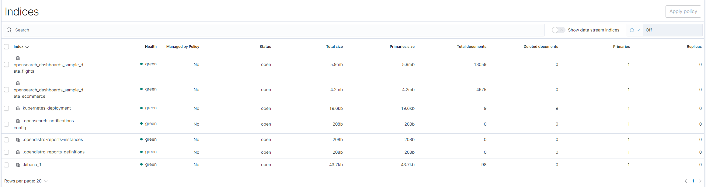

This guide will cover:

* Install `karmada-search` component in the Karmada control plane.
* Cache `Deployment` resources across multiple clusters.
* Use `OpenSearch` to graphically retrieve Kubernetes resources.

## Prerequisites

Before installing `karmada-search`, you must install Karmada control plane first. To start up Karmada, you can refer to [here](../installation/installation.md).
If you just want to try Karmada, we recommend building a development environment by `hack/local-up-karmada.sh`.

```shell
git clone https://github.com/karmada-io/karmada
cd karmada
hack/local-up-karmada.sh
```

## Install karmada-search

If you use `hack/local-up-karmada.sh`, `karmada-search` has been already installed.

If you install Karmada by Helm, you can choose any of the following ways to install `karmada-search`:

* Install `karmada-search` together in `host` mode
```shell
helm upgrade --install karmada -n karmada-system --create-namespace --dependency-update \
     --cleanup-on-fail ./charts/karmada \
     --set components={"search"}
```

* Install `karmada-search` separately in `component` mode

Edit values.yaml for karmada-search
```yaml
installMode: "component"
components: [
  "search"
]
...
```

Execute command (switch to the `root` directory of the repo, and sets the current-context in a kubeconfig file)
```shell
kubectl config use-context host
helm install karmada -n karmada-system ./charts/karmada
```

If you install Karmada by Karmada Operator, you can execute the following command while installing Karmada components:

```shell
kubectl create namespace test
kubectl apply -f - <<EOF
apiVersion: operator.karmada.io/v1alpha1
kind: Karmada
metadata:
  name: karmada-demo
  namespace: test
spec:
  components:
    KarmadaSearch: {}
EOF
```

In addition, `karmadactl` supports one-click installation for `karmada-search`.
```shell
karmadactl addons enable karmada-search
```
For more details, you can refer to [karmadactl addons instruction](../reference/karmadactl/karmadactl-commands/karmadactl_addons.md).

## Cache Deployment resources across clusters

In the following steps, we are going to cache `Deployment` resources across member clusters.
Now we have propagated a nginx Deployment to member1 and member2 according to [the example](../get-started/nginx-example.md).

### 1. Create ResourceRegistry that will cache deployment across target clusters

```yaml
### deployment-search.yaml
apiVersion: search.karmada.io/v1alpha1
kind: ResourceRegistry
metadata:
  name: deployment-search
spec:
  targetCluster:
    clusterNames:
      - member1
      - member2
  resourceSelectors:
    - apiVersion: apps/v1
      kind: Deployment
```

```shell
kubectl --kubeconfig $HOME/.kube/karmada.config --context karmada-apiserver create -f deployment-search.yaml
```

### 2. Test using Kubernetes API

You can obtain deployment resources from member1 and member2 by the following command. 

```shell
kubectl --kubeconfig $HOME/.kube/karmada.config --context karmada-apiserver get --raw /apis/search.karmada.io/v1alpha1/search/cache/apis/apps/v1/deployments
```

The output is similar to(irrelevant deployments and fields omitted):

```json
{
  "kind": "List",
  "apiVersion": "apps/v1",
  "metadata": {},
  "items": [{
    "apiVersion": "apps/v1",
    "kind": "Deployment",
    "metadata": {
      "annotations": {
        "deployment.kubernetes.io/revision": "1",
        "kubectl.kubernetes.io/last-applied-configuration": "{\"apiVersion\":\"apps/v1\",\"kind\":\"Deployment\",\"metadata\":{\"annotations\":{},\"labels\":{\"app\":\"nginx\"},\"name\":\"nginx\",\"namespace\":\"default\"},\"spec\":{\"replicas\":2,\"selector\":{\"matchLabels\":{\"app\":\"nginx\"}},\"template\":{\"metadata\":{\"labels\":{\"app\":\"nginx\"}},\"spec\":{\"containers\":[{\"image\":\"nginx\",\"name\":\"nginx\"}]}}}}\n",
        "resource.karmada.io/cached-from-cluster": "member1",
        "resourcebinding.karmada.io/name": "nginx-deployment",
        "resourcebinding.karmada.io/namespace": "default",
        "resourcetemplate.karmada.io/uid": "b46d2736-78d8-47db-b589-6e819139ba33"
      },
      "creationTimestamp": "2022-11-18T08:34:28Z",
      "generation": 1,
      "labels": {
        "app": "nginx",
        "propagationpolicy.karmada.io/name": "nginx-propagation",
        "propagationpolicy.karmada.io/namespace": "default",
        "resourcebinding.karmada.io/key": "687f7fb96f",
        "work.karmada.io/name": "nginx-687f7fb96f",
        "work.karmada.io/namespace": "karmada-es-member1"
      }
    }
  }, {
    "apiVersion": "apps/v1",
    "kind": "Deployment",
    "metadata": {
      "annotations": {
        "deployment.kubernetes.io/revision": "1",
        "kubectl.kubernetes.io/last-applied-configuration": "{\"apiVersion\":\"apps/v1\",\"kind\":\"Deployment\",\"metadata\":{\"annotations\":{},\"labels\":{\"app\":\"nginx\"},\"name\":\"nginx\",\"namespace\":\"default\"},\"spec\":{\"replicas\":2,\"selector\":{\"matchLabels\":{\"app\":\"nginx\"}},\"template\":{\"metadata\":{\"labels\":{\"app\":\"nginx\"}},\"spec\":{\"containers\":[{\"image\":\"nginx\",\"name\":\"nginx\"}]}}}}\n",
        "resource.karmada.io/cached-from-cluster": "member2",
        "resourcebinding.karmada.io/name": "nginx-deployment",
        "resourcebinding.karmada.io/namespace": "default",
        "resourcetemplate.karmada.io/uid": "e785db97-4d17-4871-99be-6d629c556b89"
      },
      "creationTimestamp": "2022-11-21T02:23:26Z",
      "generation": 1,
      "labels": {
        "app": "nginx",
        "propagationpolicy.karmada.io/name": "nginx-propagation",
        "propagationpolicy.karmada.io/namespace": "default",
        "resourcebinding.karmada.io/key": "687f7fb96f",
        "work.karmada.io/name": "nginx-687f7fb96f",
        "work.karmada.io/namespace": "karmada-es-member2"
      }
    }
  }]
}
```

## Use OpenSearch to graphically retrieve Kubernetes resources

The karmada-search also supports syncing cached resources to backend stores like [Elasticsearch](https://en.wikipedia.org/wiki/Elasticsearch) or [OpenSearch](https://github.com/opensearch-project/OpenSearch). 
By leveraging the search engine, you can perform full-text searches with all desired features, by field, and by indice; rank results by score, sort results by field, and aggregate results.

The following is an example about using `OpenSearch` to graphically retrieve Kubernetes resources.

### 1.  Deploy OpenSearch and OpenSearch Dashboard

Use the following script to deploy OpenSearch and OpenSearch dashboard.

```shell
./hack/deploy-karmada-opensearch.sh $HOME/.kube/karmada.config karmada-host
```

Verify the installation:

```shell
kubectl --kubeconfig $HOME/.kube/karmada.config --context karmada-host get po -A
```

The output is similar to:

```
NAMESPACE            NAME                                                   READY   STATUS    RESTARTS   AGE
karmada-system       karmada-opensearch-77454fbcf5-7rpvz                    1/1     Running   0          155m
karmada-system       karmada-opensearch-dashboards-596bf4d9dd-n9429         1/1     Running   0          156m
...
```

### 2. Update ResourceRegistry with backendStore

```yaml
### deployment-search.yaml
apiVersion: search.karmada.io/v1alpha1
kind: ResourceRegistry
metadata:
  name: deployment-search
spec:
  backendStore:
    openSearch:
      addresses:
        - http://karmada-opensearch.karmada-system.svc:9200
  targetCluster:
    clusterNames:
      - member1
      - member2
  resourceSelectors:
    - apiVersion: apps/v1
      kind: Deployment
```

```shell
kubectl --kubeconfig $HOME/.kube/karmada.config --context karmada-apiserver apply -f deployment-search.yaml
```

### 3. Expose the service of dashboard

You need to expose the web service to the host port so that you can visit the dashboard by HTTP requests.

```shell
kubectl --kubeconfig $HOME/.kube/karmada.config --context karmada-host port-forward svc/karmada-opensearch-dashboards 5601:5601 -nkarmada-system --address=0.0.0.0
```

### 4. Visit the dashboard

Visit OpenSearch dashboard(http://NodeIP:5601):



Now data of `Deployment` across member1 and member2 has been uploaded to `OpenSearch`. 
You can try multi-cloud search yourself by leveraging the search engine.